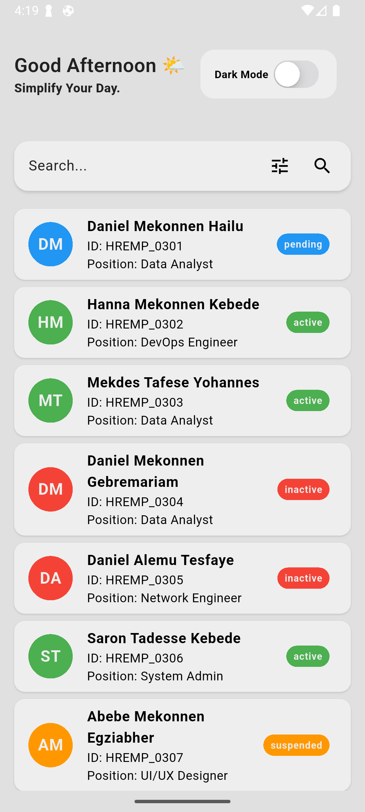
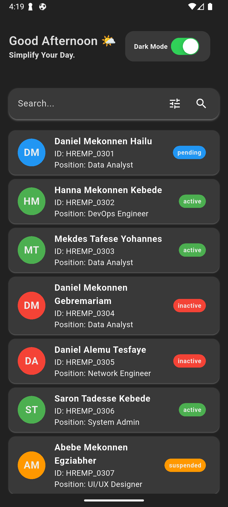

### BlackList - Employee Management App

A modern employee management application built with Flutter and GetX. BlackList provides a clean interface for viewing and managing employee information with powerful search capabilities and theme customization.

## 📱 Features

- **Employee Directory**: View a comprehensive list of all employees
- **Detailed Employee Profiles**: Access detailed information about each employee
- **Advanced Search**: Filter employees by name, ID, or position
- **Theme Customization**: Toggle between light and dark themes
- **Responsive Design**: Works seamlessly across different device sizes
- **Persistent Settings**: App remembers your theme preferences

## 🏗️ Architecture

BlackList follows a clean architecture pattern with GetX for state management:

- **Controllers**: Handle business logic and state management
- **Screens**: UI components that display data to users
- **Services**: Handle API calls and utility functions
- **Widgets**: Reusable UI components
- **Core**: Contains constants, themes, and other core functionality

### Project Structure

```plaintext
.
├── controllers/                  # GetX controllers for state management
│   ├── auth_controller.dart      # Authentication logic
│   └── employee_controller.dart  # Employee data management
├── core/                         # Core application code
│   ├── constants.dart            # App-wide constants
│   └── theme/                    # Theme configuration
│       ├── theme_controller.dart # Theme state management
│       └── theme_data.dart       # Theme definitions
├── main.dart                     # Application entry point
├── screens/                      # App screens
│   └── emploees_screen.dart      # Main employee listing screen
├── services/                     # Services for external communication
│   ├── api_services.dart         # API communication
│   ├── services.dart             # Utility services
│   └── size_config.dart          # Responsive sizing utilities
└── widgets/                      # Reusable UI components
    ├── custom_search_bar.dart    # Custom search component
    ├── custom_switch_tile.dart   # Theme toggle component
    └── info_row.dart             # Information display component
```

## 🚀 Getting Started

### Prerequisites

- Flutter SDK (3.0 or higher)
- Dart SDK (3.7.2 or higher)
- An IDE (VS Code, Android Studio, etc.)

### Installation

1. Clone the repository:

```bash
git clone https://github.com/henokcheklie/blacklist.git
cd blacklist
```

2. Install dependencies:

```bash
flutter pub get
```

3. Run the app:

```bash
flutter run
```

## 🔧 Dependencies

- **get**: State management, dependency injection, and navigation
- **http**: Handles HTTP requests for communicating with REST APIs
- **hive**: Lightweight and fast key-value database for local storage
- **hive_flutter**: Local storage for persisting settings with Flutter support
- **cupertino_icons**: Default iOS-style icons for Flutter apps
- **modal_progress_hud_nsn**: Loading indicator overlay for showi

## 🎨 Theme Customization

BlackList comes with built-in support for light and dark themes. The theme preference is automatically saved and restored when you restart the app.

To toggle between themes, use the "Dark Mode" switch in the app header.

## 🔍 Search Functionality

The app provides powerful search capabilities:

1. Use the search bar to filter employees
2. Tap the filter icon to choose search criteria:

3. Search by Name
4. Search by ID Number
5. Search by Position

## 👥 Employee Details

Tap on any employee card to view detailed information including:

- Personal information (name, gender, nationality)
- Employment details (ID, position, department)
- Status and dates (start date, creation date)

## 📱 Screenshots

### 1. Home Screen

Display a scrollable list of employees with search and filter options.

<p float="left">
  
   
</p>

### 32. Employee Detail Light Mode

Display a datail information of employees.

<p float="left">
  
   
</p>

## 🛠️ Development

### Adding New Features

1. Create necessary controllers in the `controllers/` directory
2. Add UI components in the `screens/` or `widgets/` directories
3. Update services as needed in the `services/` directory

## 🤝 Contributing

Contributions are welcome! Please feel free to submit a Pull Request.

1. Fork the repository
2. Create your feature branch (`git checkout -b feature/new-feature`)
3. Commit your changes (`git commit -m 'Add some new feature'`)
4. Push to the branch (`git push origin feature/new-feature`)
5. Open a Pull Request

## 📄 License

This project is licensed under the MIT License - see the LICENSE file for details.

## 📞 Contact

Your Name - [henokcheklie@gmail.com](mailto:henokcheklie@gmail.com)

Project Link: [https://github.com/henokcheklie/blacklist.git](https://github.com/henokcheklie/blacklist.git)
